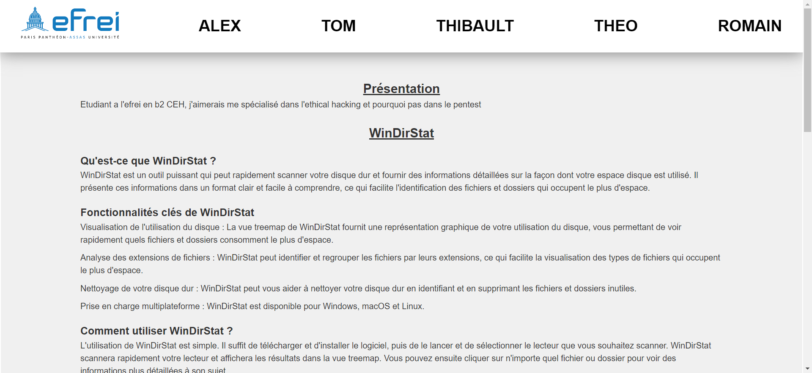
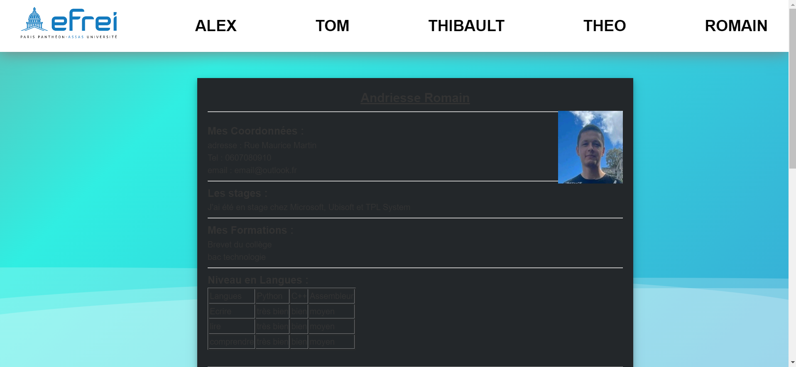
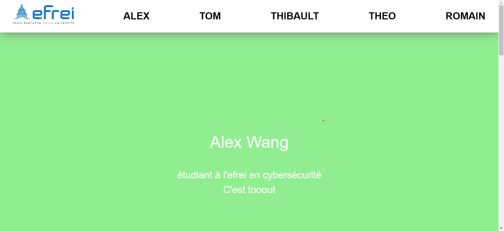
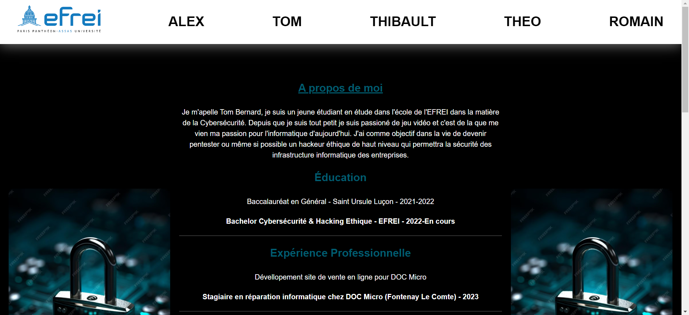
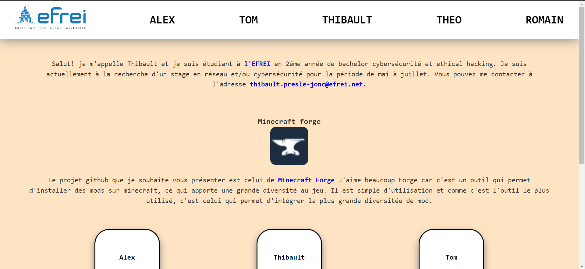

# ProjetHTML
les contributeur et BG:</br>
Théo
</br>
Romain</br>
</br>
Alex</br>
</br>
Tom</br>
</br>
Tibo</br>
</br>
</br>
</br>

# REGLE CSS A RESPECTER

**Mettre son prenom au début de chaque balise**

**Faire suivre le prénom par le thème de la balise(titre, paragraphe,...)**

**Si vous mettez des numéros, mettez les dans l'odre de la page, par exemple le numéro 1 sera tout en haut**

**Ne touhez JAMAIS le CSS de l'index**

**Attention a l'organisation, chacun se garde un emplecement, n'aller pas mélanger les CSS de tous le monde dans tous les sens**

**Ne modifier pas le CSS des autres intentionnelement**

# REGLE COMMIT A RESPECTER
**Pour les commit message:**
1. ouvrir le dossier du projet dans votre explorateur de fichier
2. ouvrir git bash 
3. mettre la commande ```git config core.hooksPath Hook```
4. Cela permettra d'activer les hook présent dans le dossier Hook du projet

# Projet

**Awesome Rails**
*Awesome Rails est une liste où il y à des ressources considérées comme exceptionnelles ou remarquables dans le contexte de Ruby on Rails.*

**Gamezone**
*Est un regroupement de petit jeu dévellopés par des gens passionés du jeu vidéo.*

**Curse forge**
*C'est une application qui permet de partager des mods du jeu minecraft.*

**Domain Name System (DNS)**
*Est un protocole très utile sur Internet qui sert à lier des noms de domaines et ip*

**WinDirStat**
*un outil pour une utilisation du disque de manière efficace.*